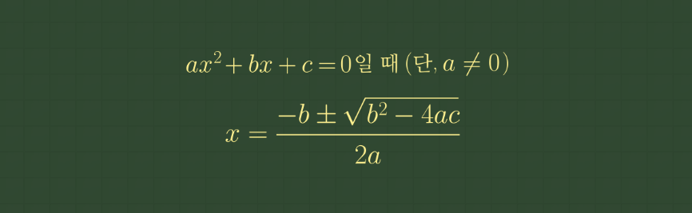
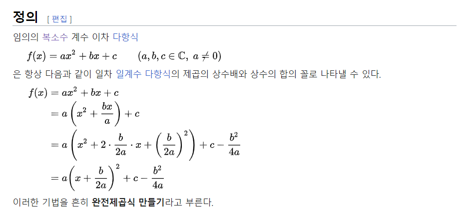
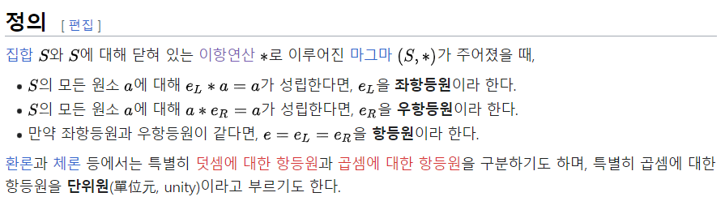

# Algebra : 대수학

대수학은 일련의 공리들을 만족하는 수학적 구조들의 일반적인 성질을 연구하는 수학의 한 분야이다

수 대신 문자를 쓰거나, 수학법칙을 간명하게 나타내는것이다. 방정식의 문제를 푸는 데서 시작되었다.

## 구분

- abstract algebra : 추상대수학
- linear algebra : 선형대수학
- [number theory : 정수론](/number_theory/README.md)

## fundamental theorem of algebra : 대수학의 기본정리

> 상수가 아닌 복소수계 다항식은 적어도 하나의 영점을 갖는다

복수소체가 실수체와 달리 대수적으로 닫힌 체 => 복소수 이상의 수의 확장은 없다.

> 차수가 1이상이고 미지수가 하나인, 복소수 계수 다항식은, 적어도 하나의 복소수 근을 갖음

즉, 복소수 계수를 갖는 모든 방정식의 해를 풀려면. 복소수 범위의 수만 있으면 충분함.

## quadratic formula : 근의 공식

이차 방정식 ax2 + bx + c = 0의 꼴을 완전제곱식으로 변형하여 근을 구할 수 있는 일반식으로 도출한것이 근의 공식이다.

## completing the square : 완전제곱식 만들기

completing the square는 이차다항식을 일차 일계수 다항식의 제곱의 상수배(perfect square)와 상수의 합의 꼴로 나타내는 기법

a(x - h)2 + k

## identity element : 항등원 (= natural element, 단위원)

군론을 비롯한 대수학에서 항등원이란 임의의 수 a 에 대하여 어떤 수를 연산했을 때 처음의 수 a가 되도록 만들어 주는 수

## 역원
